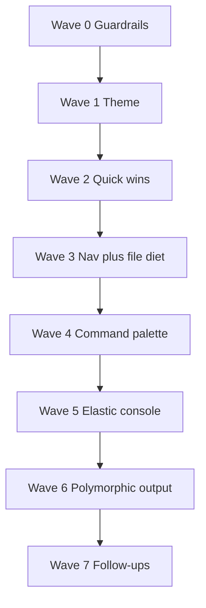

# 3rd Polishing Pass — Consolidated Order & Polymorphic Output

**Status:** planned, not implemented. No code has been changed for this plan yet.
**Relationship to the earlier passes:** this document does **not** replace `1ST_POLISHING.md` or
`2ND_POLISHING.md`. It re-sequences the eight items they contain into one dependency-aware order,
and adds a ninth (polymorphic result views) that was not in either pass. Where the two source
documents disagree on ordering, or where a new dependency appears, the recommendation here wins.

**What this document supersedes:** the *"Recommended sequencing"* section of `1ST_POLISHING.md`
(L633–642) and the *"Suggested ordering within this pass"* section of `2ND_POLISHING.md`. Their
per-item detail, diffs and blockers still stand and are referenced, not repeated.

> These are planning documents, not roadmaps. `list_plan_files()` (`tools/workspace.py`) offers a
> `.md` only when it parses as the plan AST (`check_plan_structure`), so a prose note like this one
> is never listed in the switcher. (Pass 1 and pass 2 both describe this as a `NON_PLAN_MD_FILES`
> name list in `tools/workspace.py`; that list no longer exists — the content test replaced it. The
> protection is unchanged, but the header comments in those two files are stale.)

---

## Part A — Everything on the table

| # | Item | Source | Kind |
|---|---|---|---|
| 1 | Command palette, remove the dock button strip | Pass 1, #1 | structural, **contract-breaking** |
| 2 | Promote the block/card view | Pass 1, #2 | additive |
| 3 | Consolidate navigation into the sidebars | Pass 1, #3 | structural |
| 4 | Contrast and typography | Pass 1, #4 | token-level, widest blast radius |
| 5 | Elastic, closable console | Pass 2, #1 | structural, depends on #1's dock change |
| 6 | Animate the agentic state | Pass 2, #2 | additive |
| 7 | File-tree information diet | Pass 2, #3 | **backend decision first** |
| 8 | Progress-bar state nuance | Pass 2, #4 | additive (option (c)) / schema (option (a)) |
| 9 | **Polymorphic result views** | *new this pass* | **largest; new centre-stage architecture** |

---

## Part B — Findings that force the order

These are grounded in the current tree and change what should go where.

**1. The diff backend already exists and is unused.** `task_diff()` (`tools/recovery.py`) returns
unified diffs — `{files:[{filename, action, before, after, diff[], added, removed, available}],
totals}` — and is already exposed on the bridge as `get_task_diff(task_id)` (`app.py`). **No file in
`ui/` ever calls it.** So the headline "rich diff view" is mostly a *renderer*, not new plumbing —
which is why it is tempting to do first, and why item 9 is larger than it looks in one way and
smaller in another.

**2. Item 9 reverses a settled decision.** `PLAN.md`'s `## 🌍 Global State Summary` records as
settled: *"The diff pane is removed outright."* — and §3 lists *"Remove code-level diff inspection
views entirely"* as **done**. The polymorphic recommendation puts a diff view back. This is a
legitimate reversal, but it is a reversal, and the same conflict-resolution rule pass 1 applied to
the action drawer applies here: update the Global State Summary bullet in the same pass.

**3. There is no test pass/fail signal to render.** The recommendation pairs the diff with a
"pass/fail test status indicator." `fix_bug_action` and `next_step_action` write a test file and the
summaries *claim* validation ("Regression tests confirmed", "Zero regressions detected"), but those
strings are canned prose — nothing in `orchestration/workflow/` executes the tests. A real
indicator needs a runner or an honest "test file written: yes/no".

**4. The centre stage has two states today, not a router.** `executeConfirmedTask()`
(`ui/js/actions.js`) hides `#emptyStateContainer` (the workbench) and shows `#executionStage` (the
two live agent cards); `checkAllCardsClosed()` (`ui/js/wire.js`) restores the workbench when both
cards close. Results are rendered *inside* the cards (`renderCardSummary`). Item 9 needs a **third
mount** — a result surface — without breaking the "both cards closed → workbench" rule.

**5. The router key already exists.** No event carries its action type, but `state.selectedAction`
(`ui/js/state.js`) is set when the drawer opens and is **not** cleared by `finalizeWorkflow()`. It is
therefore available as the router key for free. (Threading `action_type` into the terminal events is
the cleaner long-term fix; keying off `state.selectedAction` is the pragmatic first step.)

**6. Backup keys are knowable per action.** `next_step_action` calls
`backup_file_for_task(target_task.get("id"), …)` — the plan task id, i.e. `state.targetTaskId`.
`fix_bug_action` uses the literal `"bugfix"`; `custom_action` uses `"custom"`. So each action's diff
is reachable, but **not** by one uniform key — the renderer needs the same id vocabulary the
palette uses.

**7. The dock geometry is a two-step dependency.** Item 1 shrinks the dock head (the ~90px button
strip disappears); item 5 wants an elastic console clamped to 30% of the viewport. Retune geometry
once — item 5 lands **after** item 1. Both source docs already agree on this.

**8. `my_project_workspace/` is gitignored** (`.gitignore` L11), so a git-status badge for item 7 is
blank in the default setup — item 7's own blocker, unchanged.

---

## Part C — The adjusted order

**Recommended sequence: `0 → 4 → 8 → 6 → 2 → 3 → 7 → 1 → 5 → 9 → follow-ups`.**

In words: guardrails, then the theme, then the small additive wins, then navigation and the file
diet, then the one contract-breaking change, then the item that depends on it, and the large new
centre-stage work last — with follow-ups queued behind.



| Wave | Items | Why here |
|---|---|---|
| **0** | Pass 1 Phase 0 guardrails | Record call sites; register every new module in the four lists **and** the watchdog `required` list while it is still a no-op. Prove the plumbing before any markup moves. |
| **1** | #4 Contrast & typography | A token change that cascades into every surface. Do it first so every new component in waves 2–6 is built against final tokens instead of being re-tinted. Pass 1 already argued this. |
| **2** | #8 Progress bar (c), #6 Agentic state, #2 Block view | Smallest, self-contained, immediate visual payoff, and all additive — the low-risk confidence builders. Progress bar and block view both touch `plan-tree.js`; land them adjacently. #8 uses option (c): green/amber/neutral, no schema change. |
| **3** | #3 Navigation consolidation, #7 File-tree diet | Medium-risk structural work in the sidebars. The diet refines the tree that #3 relocates into the Files tab, so #3 first. #7 decides its signal source before writing code. |
| **4** | #1 Command palette | The **only** change that breaks the pinned `action-btn` contract, so it stays late, when everything additive is verified — pass 1's own rationale, preserved. |
| **5** | #5 Elastic console | Directly after #4: the dock head has just shrunk, so the clamp and seam visibility are retuned once. |
| **6** | #9 Polymorphic result views | Largest, needs the final theme, the enriched cards, and stable contracts behind it. |
| **7** | Follow-ups | Landed in Go 8: a real test runner (`tools/test_runner.py` + the `run_task_tests` bridge endpoint) and the Analyze source metrics (`tools/code_metrics.py`). Landed in Go 9: the failed-state mark (option (a)), with the Architect's verification as its writer — see Go 9 for the one deliberately-reversed contract. |

### Freely swappable / alternative sequencing

- **Wave 6 does not depend on waves 3–5.** The result router keys off `state.selectedAction`, which
  already exists. If the polymorphic output is the priority, pull it to wave 3 and push the palette
  down. The recommended order still lands it last because it is the largest single change and
  because it reverses a settled decision, which should be a deliberate, recorded step.
- **Lower-risk palette variant.** Pass 1's alternative stands: add the palette *alongside* the
  strip (zero contract churn) in wave 3, and delete the strip in wave 5 — but then the elastic
  console cannot land until after that, since its geometry depends on the strip being gone. Doing
  add-and-remove together in wave 4 keeps the console at wave 5.

---

## Part D — Item 9: Polymorphic result views

### The recommendation, restated

The centre workspace stops being one renderer and becomes a **UI router**: when an action
completes, mount a component chosen by the action's type.

| Action | Output | Fit against the current tree |
|---|---|---|
| Execute Next Step | Rich diff + pass/fail test status | Diff: **ready** (`get_task_diff`, key = task id). Test status: **no signal** (finding 3). |
| Analyze Code | Structured dashboard (metrics + file list) | File list: **ready** (`summary.files`). Metrics (complexity, security): **not emitted** — new backend data or omit. |
| Update Plan | Tree diff, green added / red removed, "Approve Changes" | Diff: **frontend-only** (compare `state.planTree` to `event.tree` in `plan_updated`). Approve: **no endpoint** — the plan is already saved when the event arrives. |
| Get Recommendation | Actionable cards with "Add to Plan" | Cards: **easy** (`summary.proposals` already exists, rendered as a plain `<ul>`). "Add to Plan": **no add-task API** — must route through the existing `update_plan` flow. |
| Fix Bug | Root-cause / resolution split | Root cause is **streamed prose**, not a structured field — small backend change, or parse. Diff: **ready** (key = `"bugfix"`). |
| Custom Action | Conversational canvas | This is essentially the current behaviour — the default branch should **pass through untouched**. |

### Landing points

- **New:** `ui/js/result-view.js`, `ui/css/result-view.css` (register in the four lists; JS before
  `wire.js`, CSS last).
- **Edited:** `ui/js/agent-events.js` (mount on the terminal event),
  `ui/js/actions.js` (`executeConfirmedTask` / `finalizeWorkflow` own the centre-stage swap),
  `ui/index.html` (the result mount + watchdog `required`), `ui/js/dom.js` (cache the mount),
  `ui/js/wire.js` (init step), `ui/js/plan-tree.js` (tree diff), `ui/js/workbench.js` (view
  interaction), `ui/css/plan-tree.css`.
- **Backend, only if the blocked cells are pursued:** `orchestration/workflow/actions_impl.py`
  (structured root cause; a real test verdict), `orchestration/workflow/actions_admin.py` (analysis
  metrics; an add-task / approve endpoint), `app.py` (expose them), and their tests.

### Shape of the router

A single `.result-view` mount, sibling to `#executionStage`, populated on the terminal event:

```js
// The action that just finished is the router key. It is already on state, set when the
// drawer opened and not cleared by finalizeWorkflow(), so no event payload has to change.
function mountResultView() {
  const kind = state.selectedAction || "custom";
  // custom is the only free-form case: it keeps the plain stream, so it renders nothing new.
  if (kind === "custom" || typeof renderResultView !== "function") return;
  renderResultView(kind);   // dispatches to the per-action renderer
}
```

`checkAllCardsClosed()` must keep restoring the workbench; the result view is an *additional* mount
the user can dismiss back to the tree, not a replacement for that rule.

### Blockers to settle before building

1. **Diff pane reversal** (finding 2) — update `PLAN.md`'s Global State Summary in the same pass.
2. **Test verdict** (finding 3) — ship "test file written" now, decide on a runner later.
3. **Analyze metrics** — decide whether to compute them or show only the real file list.
4. **"Approve Changes" / "Add to Plan"** — decide the endpoints before designing the buttons; a
   button that only *looks* like it approves a saved change is worse than no button.
5. **Uniform diff key** (finding 6) — the renderer needs the six-action id vocabulary, which is the
   same vocabulary the command palette uses.

### Decisions needed

- Does the result view **replace** the agent cards on completion, or sit beside/after them?
- Does it **persist** until dismissed, or fold back to the workbench when the run ends?
- Is `state.selectedAction` the router key, or do the terminal events gain an `action_type` field?

---

## Part E — Conflict register (settled decisions to update)

`PLAN.md`'s `## 🌍 Global State Summary` records decisions that these passes reverse. Each reversal
must be reflected in the summary in the same pass, or the plan contradicts the code.

| Settled decision | Reversed by | Action in the summary |
|---|---|---|
| "The right panel is a fixed 60px rail and is never drag-resizable." | #3 changes what the right rail does; #9 adds a centre result mount | Reword the rail bullet. |
| "The action-drawer entry point is renamed consistently across every reference rather than left as an alias." | #1 removes the dock strip entirely | Note the palette as the new entry point. |
| "The diff pane is removed outright." / §3 "Remove code-level diff inspection views entirely" | #9 (Execute Next Step, Fix Bug) | Reverse deliberately and say so. |

---

## Part F — Gates (unchanged from pass 1)

From the repo root, after **any** `ui/js` or `ui/css` edit — run the bundle build first, then all
four gates:

```powershell
.\venv\Scripts\python.exe tools\build_ui_bundle.py                 # regenerate index.html
node tests/ui_startup_contract.js                                  # expect 0 FAIL
.\venv\Scripts\python.exe tools\build_ui_bundle.py --check         # module/style counts match
.\venv\Scripts\python.exe -m unittest discover -s tests -t .       # full suite, OK
.\venv\Scripts\python.exe -c "import pathlib; t=pathlib.Path('ui/index.html').read_text(encoding='utf-8'); r=t[t.index('END STYLE BUNDLE'):t.index('BEGIN UI BUNDLE')]; print('<div', r.count('<div'), '</div>', r.count('</div>'))"
```

Per-wave checks and the launch checklist live in `1ST_POLISHING.md` (L584–633); the same
discipline applies to item 9 — the router must not cost the workbench its controls, so the
"both cards closed → workbench" path is a specific launch check.

---

## Part G — Progress log

### Go 1 — Wave 0 reconnaissance + Wave 1 theme (**landed**)

Gates: contract 0 FAIL · bundle `--check` up to date (19 modules, 17 stylesheets) · 334 tests OK ·
div balance 229/229.

**Landed**

- `tools/build_ui_bundle.py` regenerated after the CSS edits (mandatory: the stylesheets are
  inlined).
- **Tokens** (`ui/css/base.css`): `--bg-primary #121212`, `--bg-secondary #1a1c23`,
  `--bg-elevated #2a2d35`, `--bg-sidebar rgba(26,28,35,.94)`, `--bg-glass-card rgba(42,45,53,.78)`,
  `--border-glass #3a3d45`. Plus `body { font-size: 14px }` as the inheritance floor.
- **Reading surfaces**: workbench doc/gutter/input group `12.5px → 14px` (`workbench.css`),
  `.step-detail-bullet 10 → 11.5px` and `.plan-tree-section-header 10 → 11.5px` (`plan-tree.css`),
  `.console-stream 11.5 → 12.5px` (`console.css`), `.section-title 10 → 11.5px` (`sidebar.css`).
  Section headers also move `--text-dim → --text-muted`.
- **Cascade follow-through** (pass 1 warned; done here so the theme is not half-applied): the five
  glass surfaces that hardcoded the old secondary `rgba(37,37,38,·)` were re-pointed to
  `rgba(26,28,35,·)` — `.audit-dialog-card`, `.files-modal`, `.toast`, `.card-summary-container`,
  `.core-rules-container`.

**Deviations from pass 1's snippets (deliberate, with reasons)**

1. **`--border-subtle: #303338`, not `#2a2d35`.** Pass 1 sets `--border-subtle` equal to
   `--bg-elevated`. But `--border-subtle` is the outline of `--bg-elevated` in `.plan-tree-item` and
   `.plan-summary-card`, so equal values erase those card outlines. `#303338` preserves the original
   border-vs-elevated step (+6). Revisit if the visual pass says otherwise.
2. **`.section-title` keeps `font-weight: 700`.** Pass 1's diff says `600`, but the file is already
   `700` and pass 1's own verification note says the headers should read *bolder*. Keeping `700` and
   raising the size to `11.5px` satisfies that; `600` would have lightened them.

**Snippet drift found (the pass-1 diffs are approximations, not literal patches)**

- `.wb-src` carries **no** `font-size`; the workbench reading size lives on the
  `.workbench-doc, .workbench-gutter, .workbench-input` group. Pass 1's `11.5 → 13` targeted a
  declaration that does not exist.
- `.section-title` was `letter-spacing: 1px`, not `0.8px`.
- `.step-detail-bullet` and `.console-stream` *did* match pass 1 exactly.

**Caveat carried into Wave 2**

The workbench line box is now ~`14px × 1.65 = 23.1px`. Pass 1's Phase 2 `editTaskInWorkbench()`
scrolls by a hardcoded `18px` per line; that constant is already wrong and must be derived from the
computed line-height instead of assumed.

**Not done in Go 1 (no new module yet, so nothing to register)**

- Wave 0's "register the new files in the four lists while still a no-op" step applies to the
  palette (Wave 4) and the result view (Wave 6). The reconnaissance half is done — the `.action-btn`
  call sites are inventoried: `ui/js/wire.js` (6 wirings), `ui/js/actions.js` (L139, L146, L238,
  L298–305), `ui/js/dock.js` (L59–76), `ui/js/plan-tree.js` (L47, L362).
- The two settled-decision reversals in Part E belong to Waves 3/4/6, not the theme.

### Go 2 — Wave 2 (additive wins) (**landed**)

Gates: contract 0 FAIL (19 classes, 192 ids) · bundle `--check` up to date · 334 tests OK ·
div balance 230/230.

**#8 Progress bar (option (c), frontend only)**

- Markup gained a second band, `#planProgressBarActive` (`.progress-bar-active`), beside the
  existing `#planProgressBarFill`; the track itself is the neutral remainder. `ui/index.html`,
  `ui/js/dom.js`, `ui/js/plan-tree.js`, `ui/css/plan-tree.css`.
- `updateProgressMeter(completed, total, inProgress = 0)` now sets two widths as fractions of
  the same total plus a pulsing amber band. `renderPlanTree()` supplies the `in_progress` count.
- No schema change, so this is option (c): green = completed, amber = in progress, neutral =
  pending. The red failed-band still has no data behind it (option (a) is a follow-up).

**#6 Agentic pulse**

- `state.activeAgentIds` (a `Set`, `ui/js/state.js`) holds the working agents because
  `renderSidebarAgents()` rebuilds the lists wholesale and would drop a class set on the DOM;
  `ui/js/agents.js` re-applies the set on every rebuild; `ui/js/agent-events.js` sets/clears it on
  `architect_spawn`, `coder_spawn`, `coder_summary`, `architect_summary`, `agent_error`, and clears
  all on `workflow_complete` / `workflow_stopped`.
- The pulse animates the **indicator**, not the card, so it can never fight the existing
  `delegationPulse` (which owns the card's transform/border) if both are active at once.
- Decision taken: the main agent pulses for the **whole run** (set at `architect_spawn`, cleared at
  `architect_summary`), which is pass 2's simpler of the two options.

**#2 Block view**

- Inline **Edit** on every card, whatever the state (`planInlineActions` now returns a
  state-specific primary plus a constant `btn-inline-edit`); click handler calls
  `editTaskInWorkbench(step)` in `ui/js/workbench.js`.
- `editTaskInWorkbench` measures the line stride via `workbenchLineHeight()` instead of assuming
  `18px` — this **retires the Wave-1 caveat**. It also refuses to re-enter edit mode when already
  editing, so clicking Edit on a second card cannot discard an unsaved draft.
- Keyboard path: every card is `tabIndex = 0`; `handlePlanTreeKey` moves focus with Up/Down and
  runs the primary action with Enter (Execute when pending, otherwise expand/collapse).
- Section headers are now cards (same surface/hairline as a task card, one step quieter); the
  `plan-tree-section-header` class is unchanged.
- Harness: `btn-inline-edit` added to `contractClasses`.

**Decisions still open from pass 2**

- Progress-bar failure band (#8 option (a)) and the 30-day questions in Part D remain.
- Whether the main agent should pulse only *between* delegations (currently the whole run).

### Go 3 — Wave 3, part 1: navigation consolidation (**partly landed**)

Gates: contract 0 FAIL (20 classes, 195 ids, 78 listeners) · bundle `--check` up to date · 334
tests OK · div balance 231/231.

**Landed — 3a, left-sidebar tabs**

- The four stacked blocks are three tabs: `Agents` (both agent blocks share `data-tab="agents"`),
  `Files`, `Env`. The tab bar (`#tabSidebarAgents|Files|Env`, `.sidebar-tab`) sits at the top of
  `.sidebar-nav-scroll`; every inner id is unchanged, so `agents.js`, `sidebar.js` and `env.js`
  keep rendering into the same nodes.
- `setSidebarTab()` (`ui/js/sidebar.js`) toggles a **class** (`tab-hidden`), not the `hidden`
  attribute: an author rule already sets `display` on `.agent-section-block`, and author rules beat
  the UA `[hidden]` rule, so `hidden` would have silently done nothing.
- Collapsed rail: the tab bar is hidden and every block is shown as before
  (`ui/css/sidebar-panels.css`) — the new rule is placed *before* the existing hide group so the
  tree/env sections stay hidden when collapsed.
- Pass 1 said four tabs including `Workspace`; the fourth block is the workspace *card*, which is
  the pane's primary affordance and stays in the header, so the tabs are three.

**Landed — 3b, audit modal → right-rail panel**

- `#auditModalOverlay` changed `class="modal-overlay"` → `class="side-panel"`; every inner id is
  unchanged, so `openAuditModal()` / `closeAuditModal()` still only toggle `display`.
- `.side-panel` CSS in `ui/css/audit-modal.css`, plus overrides: the inner `.audit-dialog-card`
  drops its own frame/blur/shadow and fills the panel, and the two-column report and resolution
  pair stack (a 460px rail is too narrow for two columns).
- Click-outside-to-close is inert now (the card fills the panel); close is via the header × or the
  footer button.

**Not landed yet**

- **3d** — a Plans tab (needs a new list renderer) and repointing the rail's ⇆.

### Go 3 — Wave 3, part 2: file-tree diet (option 3) + Files tab (**landed**)

Gates: contract 0 FAIL (20 classes, 196 ids, 79 listeners) · bundle `--check` up to date · 344
tests OK · div balance 231/231.

**#7 option 3 — git first, snapshots second**

- New `tools/git_status.py` → `workspace_vcs_status()`: a workspace-relative path → one letter
  (`M` changed / `U` new). Git answers when the workspace is a work tree; the
  `.deepagents_backups/<task_id>/_meta.json` snapshots answer otherwise.
- **Bug found and fixed during verification:** the app's sandbox sits *inside* the project's own
  git repo, so `rev-parse --is-inside-work-tree` succeeded and `git status --porcelain` returned
  the whole repo's 57 changed files — repo-root-relative paths that never match workspace-relative
  ones. Git would have "won" with a non-`None` answer full of unmatched keys, silently suppressing
  the snapshot fallback. `_git_status` now requires `rev-parse --show-toplevel` to equal the
  workspace itself, so a folder merely nested in someone else's repo declines (`None`) and the
  snapshots answer instead. Verified on the real sandbox: git → `None`, snapshots →
  `{main.py: M, test_main.py: M, ui_view.html: U, test_ui_view.py: U}`.
- `list_workspace_files()` (`tools/file_ops.py`) attaches `vcs` per entry; `size` is kept because
  the Files modal still shows sizes (it builds its own string).
- Frontend: `renderTreeContents()` renders `.tree-vcs` (amber `M`, green `U`, nothing when clean)
  in the slot the size used to take; `formatTreeFileSize()` and the tree node's now-dead `size`
  field are removed; `buildWorkspaceTree()` carries `vcs`.
- 10 new tests in `tests/test_git_status.py`, including the nested-repo case; the git-path tests
  skip when git is absent.

**3c — Files goes to the tab**

- `#btnNavFiles` now calls `openFilesTab()` (expands the pane if collapsed, then
  `setSidebarTab("files")`) instead of opening the centred modal. The modal stays in the DOM and is
  reached from a new expand button in the Files tab's own title row (`#btnExpandFilesModal`).

### Decision taken (was: Go 3 blocker)

Pass 2's option **3** was chosen: git when the workspace is its own work tree, the task snapshots
otherwise. The grounded facts that drove it, and the bug the choice exposed, are recorded above.

### Go 3 — Wave 3, part 3: Plans tab (3d) (**landed — Wave 3 complete**)

Gates: contract 0 FAIL (20 classes, 200 ids, 81 listeners) · bundle `--check` up to date · 344
tests OK · div balance 234/234.

- A fourth tab, **Plans**, renders `state.availablePlans` as the same `.plan-chip` the switcher
  modal draws (so the two surfaces cannot drift). `ui/index.html`, `ui/css/sidebar.css`,
  `ui/js/sidebar.js`, `ui/js/dom.js`, `ui/js/wire.js`.
- `#btnSwitchPlan` (the rail's ⇆) now calls `openPlansTab()`; the switcher modal stays in the DOM
  and is reached from the tab's own expand button (`#btnExpandSwitchPlan`), which keeps its
  fresh-fetch path alive without making it the primary entry point.
- The list is refreshed when the tab is revealed (`refreshSidebarPlans`), because a `plan_updated`
  event carries the plan's content but no file list. It is also re-rendered from `applyPlanData`,
  the funnel every plan load/switch/save/sync already flows through.
- Tab bar widened to four: `.sidebar-tab` gained `min-width: 0` + ellipsis so the labels still fit
  a 250px pane.

### Go 4 — Wave 4: command palette (**landed**)

Gates: contract 0 FAIL (19 classes, 197 ids, 80 listeners) · bundle `--check` up to date (20
modules, 18 stylesheets) · 344 tests OK · div balance 225/225.

- New `ui/js/command-palette.js` + `ui/css/command-palette.css`, registered in all four lists (JS
  before `wire.js`, CSS last). The palette is a **router**: it calls the same `openActionDrawer()`
  the task cards call, so the parameter form is untouched.
- The dock's `.action-buttons-grid` (all six `.action-btn` buttons) is deleted, along with its now
  dead CSS in `actions.css` (the grid, `.action-btn`, its icon/text/title/sub helpers, the primary
  tint and the container query). `actions.css` also lost the drawer's `margin-top: -8px` gap
  cancel (there is no strip to butt against) and its old-grey lock-overlay literal was re-pointed.
- **Four `.action-btn` call sites had to be retargeted, not just the one pass 1 named:**
  `setActionButtonsDisabled` (`actions.js`), `updateStrictPlanLock` (`plan-tree.js` — pass 1 missed
  this one), and `setDockDrawerOpen` (`dock.js`). Both lock functions now reach
  `.palette-item, #btnCommandPalette`.
- `#lblNextStepTarget` lived *inside* the strip, so `updateNextStepButtonPreview()` and its cache
  were removed; the next-step target is still shown by the drawer's own target card.
- Cache/wiring swaps: `dom.js` drops the six `btnAction*` caches and `lblNextStepTarget`, gains the
  four palette ids; `wire.js` drops the six button wirings, adds `runStartupStep("Command palette", …)`
  and the top-bar trigger. The head watchdog's `required` list gained the three palette functions.
- Dock floor retuned for the smaller head: `MIN_HEIGHT` 160 → 120 (`dock.js`),
  `.bottom-dock.drawer-open` 424px → 320px (`dock.css`).
- Harness: `action-btn` removed from `contractClasses`; the assertion flips from "six buttons still
  present" to **"the dock button strip is gone (0 found)"** plus "the command palette exposes six
  commands".
- Verified by hand (the gates cannot see the window): the module renders 6 items, filtering to
  `fix` dispatches `fix_bug`, selection closes the overlay, and a non-match renders the empty state.

**Line-ending trap worth remembering.** `write_file` produced the new files with CRLF; the bundle
*generator* normalises to LF via `read_text`, so `--check` passed while the harness's byte-exact
comparison (raw `readFileSync`) failed with "stale: command-palette.js". Newline normalisation is
the fix; `.gitattributes` keeps the repo LF.

---

### Go 5 — Wave 5: elastic console (**landed**)

Gates: contract 0 FAIL (19 classes, 198 ids, 81 listeners) · bundle `--check` up to date (20
modules, 18 stylesheets) · 344 tests OK · div balance 225/225. Plus a throwaway render harness
(26 assertions, deleted) exercising the whole visibility state machine in a `vm` sandbox.

**The shape.** The console is a **run-scoped pane** now. `.bottom-dock.console-hidden` collapses
the dock to its head (`height: auto !important`, so it beats an inline height the seam wrote) and
takes both `.dock-logs` and `.dock-resize-handle` out of the flow. Visibility is a class on the
*dock*, not a style on the pane, because the dock has to shrink at the same moment.

- `ui/js/console.js` gains the section **Dock visibility**: `state.consoleVisible` /
  `state.consolePinned`, `showConsole` / `hideConsole` / `toggleConsole`,
  `syncConsoleVisibility` / `syncConsoleToggle`, and `revealConsoleForAttention`. The Ctrl+\`
  binding lives in `initTerminalConsole` (next to the palette's Ctrl/Cmd+K), matched on
  `code === "Backquote"` **and** `key === "`"` so a dead-key layout still works.
- `ui/js/dock.js`: the ceiling is **30% of the viewport**, replacing 60% of the pane. `MIN_HEIGHT`
  stays **120** (see the deviation below).
- `ui/js/agent-events.js`: hooks on `workflow_started` (clear the pin, open), `agent_error` (pin +
  open), `workflow_stopped` and `workflow_complete` with `status === "stopped"` (pin + open), and
  `workflow_complete` otherwise (`hideConsole()` unless pinned). The two refusal summaries are
  recognised by `isRefusalSummary()` on `summary.status` (`"Input Required"`,
  `"Needs Manual Structure"`) inside the existing `architect_summary` case — the event type does not
  distinguish a refusal from a success, only that string does.
- New `#btnConsoleToggle` in `.dock-status-right`, next to Stop. `.dock-status-right` had **no
  rule at all** before this (the Stop button was its only child and got by as a block box), so
  `actions.css` gains the flex row plus the button.

**Deviations, stated honestly.**

1. **"Idle" was read as the hide condition, not "error only".** The recommendation's phrase is
   *"auto-reveal only when an agent throws an error or requires manual intervention"*; taken
   literally the transcript would stay hidden for every successful run, which loses the stream the
   pane exists to show. Implemented instead as: opens when a run starts, folds away when a run
   finishes cleanly, and *stays* up (pinned) after an error or a refusal. The literal reading is a
   one-line change (`workflow_started` → do nothing) if that is what was wanted.
2. **`MIN_HEIGHT` is still 120, not pass 1's 130.** Verified by derived measurement rather than a
   real render: the dock head is the status row (~6px padding-top + 1px rule + a ~25px control +
   10px container padding + 1px dock border ≈ **43px**), so 120 leaves ~75px of transcript at the
   floor — a usable handful of lines. The number is *reasoned*, not eyeballed; the window is the
   check that settles it.
3. **A visible toggle was added beyond the spec.** Ctrl+\` alone would leave a collapsed pane with
   no discoverable way back, so the dock head carries the same control.
4. **A user's manual hide is not remembered as a preference.** Hiding the console by hand does not
   stop a later `workflow_complete` from folding it away (already hidden) — harmless — but opening
   it by hand during idle and then completing a run *will* fold it away. Deliberate: idle means
   collapsed. Worth revisiting if it reads as the app fighting the user.

**Incidental fix.** The console bar's two glyphs were the six literal characters `\u2922` and
`\u29c9` in the *markup* (a JS escape written into HTML), so the bar rendered `\u2922` as text. They
are the real ⤢ and ⧉ now. Found while editing that block; the same trap is worth grepping for.

**Also retuned.** `.bottom-dock.drawer-open` is scoped to `:not(.console-hidden)`: collapsed, the
new 320px floor would leave a drawer-height hole where the transcript is not. Its comment was still
describing the pre-Wave-4 146px button strip and is corrected. A self-flagging `console-attention`
tint (1.8s, class removed on a timer) marks a console that revealed itself.

**Eyeball checklist (the agent cannot see the window):**

- Launch: the dock is a single ~43px status row (plan pill · progress · Console · Stop). No
  transcript, no seam grip.
- Ctrl+\` and the Console button both raise the dock to 240px with the transcript and the grip; the
  button tints cyan and its chevron flips down.
- Drag the seam: it clamps at ~30% of the window height, not 60% of the pane. Hide, re-show: the
  dragged height comes back.
- Start a run: the console opens. Let it finish cleanly: it folds away.
- Run `Fix Bug` on an empty report, and the Normalization Gate on prose-only markdown: the console
  opens, the bar tints once, and it is **still up** after the run ends.
- Stop a run mid-flight: the transcript stays up.
- With the console collapsed, click Commands → pick one: the drawer opens whole with no empty gap
  above it. Stop stays visible during a run.
- Expand the console (⤢), then hide it with Ctrl+\`: the overlay unwinds and the ⤢ chevron resets.

---

### Go 6 — Wave 6: polymorphic result views (**landed**)

Gates: contract 0 FAIL (19 classes, 206 ids, 84 listeners) · bundle `--check` up to date (21
modules, 19 stylesheets) · 344 tests OK · div balance 227/227. Plus a throwaway render harness
(22 assertions, deleted) exercising the async renderers, the stale-render guard and the "Add to
Plan" routing in a `vm` sandbox, and a real-backend read of `task_diff` across the sandbox's own
`my_project_workspace/.deepagents_backups/` (keys `bugfix`, `custom`, `task-N` all confirmed,
with the exact line shape the renderer assumes).

**The shape.** The centre stage stops being one renderer and becomes a router. New
`ui/js/result-view.js` + `ui/css/result-view.css`, registered in all four lists (JS before
`wire.js`, CSS last). `#resultView` is a **full-stage overlay**, a sibling of `#executionStage`
and `#previewPane` inside `.stage-center`, at `z-index: 5` above the preview's 4.

- **The router key is `state.selectedAction`** — already set by `openActionDrawer()` and not
  cleared by `finalizeWorkflow()`, so no event payload changed. `mountResultView()` skips
  `custom` (the free-form case), any refusal, and any unknown id.
- **The mount point is `workflow_complete`**, and only when the status is not `stopped`: a halt
  leaves the transcript, which is the surface the user asked for.
- **Three payloads the terminal event does not carry** now live on `state`: `lastSummary` (set in
  the `architect_summary` case), `planTreeBeforeUpdate` (captured in the `plan_updated` case
  *before* `applyPlanData()` overwrites `state.planTree`), and `lastRunRefused`.
- **One deliberate addition beyond the spec:** `#btnWorkbenchResult` in the workbench toolbar.
  Without it, dismissing the overlay would be a one-way door — the payload survives, so the
  button rebuilds the same view rather than re-running anything.
- `executeConfirmedTask()` calls `resetResultView()`, so a new run cannot inherit the previous
  run's result, and `openActionDrawer()` gained `extraParams.prefill` so "Add to Plan" can hand
  the Update Plan form the proposal it is asking the user to confirm.

| Action | Rendered | Payload |
|---|---|---|
| Execute Next Step | Rich diff + test-status strip | `get_task_diff(state.targetTaskId)` |
| Fix Bug | Root cause / resolution split | `get_task_diff(<target task id or "bugfix">)` + `summary.root_cause` |
| Update Plan | Tree diff, added/removed/updated | `planTreeBeforeUpdate` vs `state.planTree` |
| Analyze Code | Stat grid + findings + interactive file list | `summary.files`, `summary.deliverables` |
| Get Recommendation | One card per proposal, each with "Add to Plan" | `summary.proposals` |
| Custom Action | nothing; the raw stream stays the answer | — |

**Backend change (the small one Part D allowed for).** The fix_bug `architect_summary` now carries
`root_cause` and `fix_spec` as fields. The diagnosis was already emitted as a formatted log line;
recovering it by parsing that line would have coupled the view to one string's wording, so the two
values are hoisted into variables and used by both the narration and the payload. Nothing else in
the summary changed, and `tests/test_characterization.py::test_fix_bug_event_sequence` now pins the
two fields.

**Deviations, stated honestly.**

1. **The mount is an overlay, not a third centre-stage state.** Part D left it open whether the
   result view *replaces* the cards. It covers them instead, following the precedent the preview
   pane already set in the same container. That keeps `checkAllCardsClosed()` — both cards closed
   → workbench — completely untouched, which is the specific launch check Part F asks for, and it
   keeps `executeConfirmedTask()`'s two-state swap as it is. Dismissing reveals the cards; closing
   both returns to the plan tree.
2. **No "Approve Changes" button on Update Plan.** The plan is already written to disk before
   `plan_updated` arrives — there is no staging step for an approval to confirm. The view shows the
   diff, says "Applied to PLAN.md", and offers a real "View in workbench" instead of a button that
   would only look like it approves something.
3. **No pass/fail test verdict.** Nothing runs the tests the backend writes, so a green "tests
   pass" badge would be fiction. The strip names the test file and says **not run**. A real runner
   is the Wave 7 follow-up this indicator is blocked on. *(Resolved in Go 8: the strip now shows
   the real verdict from `tools/test_runner.py`.)*
4. **The Analyze dashboard carries no complexity or security widgets.** Those numbers are not
   computed by the action, and drawing them as zeroes would read as a clean bill of health. The
   dashboard shows the two real figures (files inspected, findings reported), the findings, and an
   interactive file list — and says in the panel that the other metrics are not computed yet.
   *(Resolved in Go 8: the metrics are computed by `tools/code_metrics.py` and rendered.)*
5. **Refusals and halts mount nothing.** The `fix_bug` sufficiency gate and the Normalization Gate
   end with `workflow_complete(status="finished")` just like a success; only `summary.status`
   distinguishes them, so `architect_summary` now also records `state.lastRunRefused`.
6. **"Add to Plan" is a router, not an endpoint.** There is no add-task API. The button opens the
   existing Update Plan drawer with `Add this to the plan: <proposal>` prefilled, so the proposal
   goes through the same confirm step as any other plan edit — and the view states that in a note.

**Harness.** `tests/ui_startup_contract.js` gained section 9 (six checks): `custom` renders
nothing, a recommendation renders one card per proposal, a plan update renders added/removed/
updated rows, a refusal mounts nothing, `workflow_complete` mounts the action's own renderer, and
the diff renderer drops the two file headers while classing `+`/`-`/`@@` lines. `result-view.js`
and `result-view.css` were added to `MODULES`/`STYLESHEETS`, and the head watchdog's `required`
list gained the five new entry points.

**Also updated.** `PLAN.md`'s Global State Summary (Part E's conflict register): the diff-pane
reversal is now recorded as deliberate and bounded — one place only, no diff buttons returning to
the rail or the cards — the palette is named as the action-drawer entry point, and the layout
bullet describes the tabbed sidebar and the elastic console. §3's "Remove code-level diff
inspection views entirely" task carries a sub-step recording the reversal where a reader of that
section will look.

**Eyeball checklist (the agent cannot see the window):**

- Run `Execute Next Step`: when it finishes, the stage is covered by a result view — the task name
  in the bar, `+N` / `−M` and `N files changed` pills, then one bordered block per file with the
  added lines green and the removed lines red.
- Dismiss it with ✕: the agent cards are underneath, exactly as before this wave.
- Close both cards: the plan workbench comes back (the Part F launch check), and the toolbar now
  shows a **Result** button next to Tree / Raw MD. Click it: the same diff returns.
- Run `Update Plan`: the result view shows Added / Removed / Updated columns, green and red rows,
  an "Applied to PLAN.md" pill and "View in workbench".
- Run `Analyze Codebase`: two stat tiles, a Findings list, and a file list whose chips are buttons
  that jump to the Files tab.
- Run `Get Recommendation`: one card per proposal, each with "Add to Plan". Click one: the result
  view closes and the dock drawer opens on Update Plan with the proposal already in the directive
  field — confirm it to actually change the plan.
- Run `Custom Action`: nothing new mounts; the cards and the transcript are the whole answer.
- Run `Fix Bug` with a real description: the top pane names the root cause and the fix spec, the
  bottom pane shows the patch to `main.py`.
- Submit `Fix Bug` with an empty report: no result view mounts; the console opens on the refusal.
- Stop a run mid-flight: no result view mounts; the transcript stays up.
- Run a task with the Live Preview open: the result view appears over the preview (z-index 5);
  dismissing it uncovers the preview rather than the cards.

---

### Go 7 — Wave 7: layout consolidation (**landed — Wave 7 complete**)

The user re-scoped Wave 7 with four structural requests. All four are landed here: requests 1–2
were surgical, and requests 3–4 retuned the dock once the one open question was answered.

**Request 1 — plan selection lives in the left sidebar only.**

Grounding changed the ask slightly. `#tabSidebarPlans` **had no listener at all**: the tabbed
sidebar wired Agents, Files and Env and left Plans out, so the rail's ⇆ was the *only* route to
the Plans tab — exactly the symptom described ("change plan at right side bar is the only way to
go to plan file selection"). The fix is therefore two-sided:

- `ui/js/wire.js` wires `#tabSidebarPlans` → `openPlansTab()`. It routes through `openPlansTab()`
  rather than the `setSidebarTab("plans")` its three siblings use, so the one entry point that
  can also be reached programmatically still expands the pane first.
- `#btnSwitchPlan` (the rail's ⇆) is **deleted**, with its `dom.js` cache entry and its `wire.js`
  listener. `openPlansTab()` keeps a caller, so nothing became dead code.
- The switcher modal stays, reached from the Plans tab's own expand button
  (`#btnExpandSwitchPlan`) — see request 2.

Contract impact: the id inventory drops **206 → 205** (the harness derives it from `dom.js`, so
no assertion moved), listeners stay **84** (one `on()` swapped for another), div balance 227/227.

**Request 2 — Create Plan (and the switcher) is a right-rail slide-in, not a pop-up.**

`#createPlanModalOverlay` and `#switchPlanModalOverlay` change `class="modal-overlay"` →
`class="side-panel"`, copying the audit report's Wave 3b conversion exactly: same element ids,
same `openX()/closeX()` bodies (they only toggle `display`), and `.side-panel` supplies the
layout. `ui/css/audit-modal.css` generalises its frame reset to cover both hosted cards and gives
`.side-panel > .plan-setup-modal .modal-body` `flex: 1; overflow-y: auto` — a rail is tall, so
the plan list scrolls inside the panel instead of growing the card past the window the way the
centred 480px dialog did.

The switcher was converted too: it is the same `.plan-setup-modal` in the same `.modal-overlay`
and is now the plan-selection surface request 1 names, so leaving it a centred pop-up would have
split one interaction across two presentations.

**Deviation.** The Normalization Gate (`#normalizeGateModalOverlay`) is also a
`.plan-setup-modal` pop-up and was **not** converted. It is a blocking decision about the
*current* plan rather than a create/select flow, and the user named only Create Plan. It is a
one-line class change if the same treatment is wanted.

**Request 3 — the dock's read-only status row is retired.**

The top bar already carried the active plan (`#topActivePlanBadge` / `#txtTopActivePlanName`), so
the dock's pill was a second copy of the same fact. Landed as:

- `#readonlyPlanPill`, `#planStatusDot` and `#txtBottomActivePlan` are **deleted** from the
  markup, the `dom.js` cache and the `applyPlanData()` write in `ui/js/plan-tree.js`.
- `#txtDockProgress` → **`#txtTopProgress`**, relocated into `.top-status-left` right of the
  badge. `updateProgressMeter()` writes `${completed}/${total} (${percent}%)` into it (the dock's
  ` Tasks` suffix is dropped — the top bar is tighter). New `.top-progress-pill` in
  `ui/css/stage.css` replaces `.dock-progress-pill` (deleted from `ui/css/actions.css`).

**Request 4 — Stop to the top bar, the console toggle to the rail's foot.**

- `#btnDockStop` → **`#btnStopRun`**, moved into `.top-status-left` beside the progress figure;
  `.btn-stop-dock` → `.btn-stop-run` (moved to `ui/css/stage.css`). It is still `display:none`
  until a run starts (`executeConfirmedTask` / `finalizeWorkflow`, `ui/js/actions.js`) and still
  wired through `handleStopClick` (`ui/js/wire.js`). **The Wave 5 invariant is preserved — Stop
  stays reachable during a run** — and is now stronger: it lives in a permanent bar instead of a
  dock head the console can hide.
- `#btnConsoleToggle` moved into a new `.plan-sidebar-footer` at the foot of
  `.right-plan-sidebar` (`margin-top:auto`; `ui/css/sidebar-panels.css`). It is a 28px rail icon
  (`.rail-console-toggle`) matching `.btn-plan-action`, not the dock pill it was — and it is the
  home `PLAN.md` §3 always intended for it ("Console Toggle (💻)"). `syncConsoleToggle()` drops
  the ⤒/⤓ glyph swap; open/closed is carried by `aria-expanded` and the cyan tint. The id and its
  listener are unchanged. The footer is deliberately **not** in the collapsed rail's `display:none`
  group, so it shows whether the pane is collapsed or not.

**Deviation, stated plainly: `#bottomDock` is not deleted.** The user asked to keep the console
bottom-docked ("Imma keep console at the bottom with its button at the bottom of right side
bar"), which overrode the earlier recommendation to delete the dock and host the console in a
widened rail. What actually changed is that the dock's head (`.action-control-panel-container`)
now holds only the command drawer and the lock notice, so:

- `ui/css/dock.css` gains `.bottom-dock:not(.drawer-open) > .action-control-panel-container:not(.plan-locked) { display: none }`,
  which takes the empty head out of the flow: at idle the dock is nothing but its top border, and
  with the console open there is no 10px pad left stranded above the transcript.
- The plan-lock notice is now the head's only permanent occupant, so `updateStrictPlanLock()`
  toggles a `plan-locked` class on the container and the CSS keeps that head on screen with its
  own `min-height` — otherwise removing the status row would have silently made the "switch or
  create a plan" notice unreachable.
- `initDockResize()`'s `MIN_HEIGHT` comment is retuned: the head is out of the flow at idle now,
  so the floor is transcript lines rather than authoring for a ~45px status row.

**Not re-decided (the paused round's answers stand):** the right pane stays a **forced 60px
rail** — the user rejected widening it — and the action drawer stays **at the bottom** of the
dock. The recommended alternative (widen the rail, host the drawer above and the console below)
was put to the user and declined in favour of the button-only move.

Gates after requests 3–4: contract ALL CHECKS PASSED (19 classes, **203 ids**, 84 listeners) ·
bundle `--check` up to date (21 modules, 19 stylesheets) · 344 tests OK · div balance **224/224**.

**Eyeball checklist (the agent cannot see the window):**

- Click the left sidebar's **Plans** tab: it activates and reveals the plan list (it used to do
  nothing).
- The right rail's button column is now Audit (🛡️), Create (＋) and Re-tag — the ⇆ is gone.
- Click ＋ in the rail: the Create Plan form slides in from the right edge over the rail instead
  of appearing centred behind a dimmed backdrop. Its × closes it.
- In the Plans tab, click the tab's own expand button: the switcher slides in the same way, and a
  long plan list scrolls inside the panel.
- The audit report (🛡️) still slides in exactly as before — the shared reset did not disturb it.
- The top bar reads **Ready · PLAN.md · 0/0 (0%)**, and the completion figure tracks the plan as
  tasks complete (it used to be a duplicate pill at the bottom of the window).
- Start a run: **Stop Task** appears in the top bar beside the progress figure. With the console
  hidden it is still on screen (that was the Wave 5 invariant).
- The right rail's foot now holds a **terminal icon**: click it and the console slides up from the
  bottom; the icon tints cyan while the console is open; Ctrl+` does the same.
- At idle there is **no bottom bar at all** — not even an empty strip — while the centre stage is
  inactive. Opening a command from the palette brings the drawer back up from the bottom.

---

### Go 8 — Wave 7 follow-ups: the real verdicts (**two landed, one blocked — resolved in Go 9**)

Row 7 named three things: the failed-state mark (option (a)), a real test runner, and the backend
endpoints item 9 deferred. Two landed here; the first is **blocked on a decision, not on code** and
is reported rather than guessed at.

**Follow-up 1 — a real test runner (landed).**

The result view's strip said **not run** because nothing executed the test the Coder writes. New
`tools/test_runner.py` closes that: it finds the test file(s) a task is answerable for from the
task's own `.deepagents_backups/<key>/_meta.json`, runs them with pytest, and classifies the
outcome from the runner's exit status and summary line — `passed` / `failed` / `error` / `missing` /
`unavailable`, never inferring a pass.

- **On demand, not in the workflow.** `BridgeAPI.run_task_tests` is called by the result view when
  it opens, so **the pinned workflow event stream is untouched** and no test runs during a workflow.
- **Finding the file without a new writer.** `next_step` snapshots both the deliverable and its test
  (the test is named directly); `fix_bug` snapshots only the patched file, so the paired
  `test_<stem>.py` is derived with the same `paired_test_path` rule the Coder writes with (imported
  lazily from `orchestration.workflow.generation` — `tools` is the lower layer, so a module-level
  import would let a cycle close).
- **Read-only.** `PYTHONDONTWRITEBYTECODE=1`, `-p no:cacheprovider` and `-o addopts=`, so opening a
  result view leaves no `.pyc`, no `.pytest_cache`, and takes no plugin the workspace's own config
  would inject. Verified: the runner leaves nothing new in `my_project_workspace/`.
- **Frontend.** `resultTestPill(tests, files)` renders a green `Tests: N passed`, a red
  `Tests: N passed, M failed`, or an amber error/not-run — and says **not run** rather than green
  when the browser preview has no bridge. Both code renderers (`next_step`, `fix_bug`) await the
  verdict behind the same staleness guard the diff uses.

Real verdicts against the sandbox's own backups: `task-6` → *1 passed*; `task-1` → *1 error* (its
`main.py` does not import); `bugfix` → *1 error*. The errors are honest — the generated
deliverables do not run — which is exactly the signal the recommendation wanted.

**Follow-up 2 — the Analyze source metrics (landed).**

Item 9's fourth blocker was a *decision*: compute the dashboard's metrics or keep showing only the
real file list. Recorded here as **compute**, because a zero widget reads as a clean bill of
health. New `tools/code_metrics.py` derives, with the stdlib `ast` module and no dependency:
cyclomatic complexity per function (nested functions counted once, on their own pass), hotspots at
≥10, a security review of *shaped* calls (`eval`/`exec`/`__import__` by bare name; `os.system`,
`pickle.loads`, `yaml.load`, `subprocess.*(shell=True)` by full path — a method that merely shares a
dangerous name is not flagged), and a parse-coverage figure so a syntax error is visible rather
than hidden. `analyze_action` puts it on the summary as `metrics`, the dashboard renders stat tiles,
a hotspots pane and a security-flags pane, and a run with no metrics says so instead of implying
health. The measurement adds no new endpoint — it runs in the action.

**Follow-up 3 — the failed-state mark, option (a) (BLOCKED — needs a decision).**

The `[!]` failed mark is **not** a renderer change, and two findings make that concrete:

1. **There is no writer for a failed state anywhere.** `next_step_action` unconditionally sets
   `target_task["status"] = "completed"` after writing the deliverables; the Architect's `py_compile`
   verification runs *after* the plan is saved and never feeds back into the status. Rollback resets
   to `pending`. So a red progress band would have no data behind it — the honesty standard from
   Wave 6 applies.
2. **A deliberately-preserved contract has to be reversed.** `tests/test_characterization.py`
   asserts, on purpose, that `[!] not a real checkbox` is **not** a checkbox
   (`test_non_checkbox_bullet_appends_to_previous_task_details`), and `test_metrics` pins the exact
   five-key metrics dict. Adding `!` to `_CHECKBOX_RE` reverses that captured behaviour, and needs a
   fourth mark through the parser, both compiler sites, `plan_state` metrics, `_status_mark` in the
   context slicer, and the status branches in `agents/laya.py` and `tools/recovery.py`.

The open questions are 2ND_POLISHING §4's: *does a failed task block the next one; is a failure
retried or does it wait for a human; which mark does the plan carry and does it round-trip without
leaking into the title.* The cleanest writer the reconnaissance found is the Architect's
verification failing (a task whose code does not even compile), to be decided before any code.

*(Resolved in Go 9: the decision was taken and the mark, the writer and the gate all landed. See Go 9
for the design, the root-cause bug the new gate surfaced, and the one contract it reversed.)*

**Follow-up 4 — the endpoints item 9 deferred (deliberately unchanged).** "Approve Changes" is
still absent because the plan is written to disk before `plan_updated` arrives, and "Add to Plan"
still routes through the existing `update_plan` drawer rather than a new add-task API. The only new
endpoint is `run_task_tests`.

Gates after Go 8: contract ALL CHECKS PASSED (19 classes, **203 ids**, 84 listeners; +5 new checks)
· bundle `--check` up to date (21 modules, 19 stylesheets) · **369 tests OK** (+25) · div balance
**224/224**.

**Eyeball checklist.**

- Run `Execute Next Step`, then open the result view: the strip beside `+N` / `−M` now names a real
  verdict — green `Tests: N passed`, red `Tests: N passed, M failed`, or amber `Tests: N error(s)`.
- A task whose test passes shows green; in the default sandbox most tasks show **amber `1 error`**
  because the generated `main.py` does not import — that is the runner telling the truth, not a bug.
- Run `Analyze Codebase`: the dashboard now shows Modules parsed / Functions / Avg complexity /
  Hotspots (≥10) / Security flags tiles, plus a Complexity-hotspots pane and a Security-flags pane,
  each row `file:line` then the finding.
- Open the app in a browser layout preview (no bridge): the test strip falls back to **not run** and
  the Analyze dashboard says no metrics were computed for this run.

### Go 9 — The failed-state mark + the Architect test gate (**landed — follow-up 3; one contract reversed**)

Follow-up 3 was blocked on a failure-semantics *decision*, not on code. The decision was taken with the
user, and the writer it needed turned out to be the Architect's own verification.

**The design agreed.** The Coder writes the tests; the Architect calls the run:

- **Coder writes the tests.** Already true: `templates.select()` returns a `Deliverable(filename,
  test_filename, code, test_code)` and `next_step_action` writes both.
- **Architect calls the run, before the status write.** The verification block (`py_compile` plus the
  Go 8 runner `tools/test_runner.py`) was moved from *after* `save_plan_state` to *before* it, so its
  verdict chooses the status instead of only narrating it.
- **Verdict mapping.** A compile error, or tests that ran and **failed** ⇒ `failed`. An inconclusive
  outcome (a collection error, a missing runner, no test file) ⇒ `completed`. Never infer a failure —
  the same rule the result view's test pill follows.
- **Failure semantics.** The run continues (a failed task does not block the next); retry is on demand;
  the plan carries `[!]`.
- **Why not a Tester agent.** The coder path is deterministic (not a live `deepagents` graph),
  `coder-standard` already owns "writing tests", and the missing piece was a separate *runner* — a tool
  call, not an author. Revisit only if tests need judgment.

**Four marks, not three.** `tools/plan_parser.py` accepts `[!]` in `_CHECKBOX_RE`, `_status_from_mark`
returns `"failed"`, and a new `_MARK_FOR_STATUS = {"completed": "x", "in_progress": "-", "failed": "!"}`
drives both compiler sites. `plan_state` metrics gain `failed_tasks`, and `pending` becomes
`total − completed − in_progress − failed`; `context._status_mark` gained the `[!]` case.

**The root-cause bug this surfaced.** With the verification block now deciding the status, every task
came back `failed`. The cause was *not* the new gate: `run_command_in_workspace` always returns a
non-empty block (`[Exit Code: N]` plus the output), so the old `bool(compile_error)` test was **always
true**. The fix is a parser beside the format string — `tools.shell_tools.command_exit_code` /
`command_failed` — that reads the exit code and treats "no verdict at all" (a timeout, a start-up
error, a whitelist refusal) as inconclusive, not as a failure. The same latent bug in
`fix_bug_action`'s narration (it always printed the raw block instead of the clean-verified line) was
fixed with it.

**Frontend.** `plan-tree.js` renders `✕` with a `failed` class, counts `failed` into the meter, gives a
failed task a **Retry** button (no Rollback — it is already un-completed), and drives a third band
`updateProgressMeter(completed, total, inProgress, failed)`; the failed band is solid `#ef4444`, not
animated. `result-view.js` maps `failed` in the plan-diff rows, and `ui/index.html` gained the band div
(`#planProgressBarFailed`, outside the bundle regions).

**⚠ Contract reversed (the only deliberate reversal in the pass).**
`test_non_checkbox_bullet_appends_to_previous_task_details` existed to pin `[!] not a real checkbox`
as *not* a checkbox. That assertion is now reversed: it pins `[?]` instead, and a new
`test_failed_mark_is_a_real_status_and_round_trips` pins the `[!]` round-trip. `test_metrics` gained
`failed_tasks`. Named loudly here because the harness's value is that reversals are never silent.

**The same gate on `fix_bug` (verdict only, no plan mark).** `fix_bug` now runs the compile check and the
task's regression test, and its verdict chooses what it reports: a patch that does not compile, or whose
suite runs and fails, is **Verification Failed** with a retry proposal, instead of the unconditional
"Verified & Approved". The coder card also stopped claiming "Patch Applied **& Tested**" — the Architect
runs the test, so the coder states only what it did ("Patch Applied").

Two findings stopped the `[!]` mark from landing here, and they are reported rather than worked around:

1. **`fix_bug` owns no plan task.** Its only task key is the literal `bugfix` (the snapshot name), and
the plan has no `bugfix` task. Attributing the failure to a roadmap task by filename was rejected: in
the sandbox `main.py` is recorded by **both** task-1 and task-3, and the recorded `files` are the canned
coder's deliverables rather than the task's real target — so the attribution would be a guess, which is
exactly the kind of invented claim the pass has refused elsewhere.
2. **The canned regression suite is inconclusive against most workspaces.** `BUGFIX_REGRESSION_TEST`
imports `SolutionEngine`, which a real target file need not contain, so the runner reports an *error* and
the fix stays approved. That is the honest outcome under the rule; it also means a test-driven `[!]`
would almost never fire for a bug fix, so the compile check is the meaningful part of this gate.

Plumbing the mark would take a real change of contract — a `targetTaskId` carried from the UI (for
example on the Retry of a `[!]` task) so the fix names the task it is answering for. That route landed
next, as Go 10.

Gates after Go 9: contract ALL CHECKS PASSED (19 classes, **203 ids**, 84 listeners) · bundle `--check`
up to date (21 modules, 19 stylesheets) · **375 tests OK** (+6) · div balance **225/225** (+1, the failed
band).

**Eyeball checklist.**

- Run `Execute Next Step` on a task whose generated test passes: the task shows `[x]` and the progress
  card shows no red.
- Force a failing task (a deliverable whose test asserts `False`): the task shows a red `✕`, its title
  is tinted red (not struck through), and the plan details carry a `Verification failed: …` line.
- The progress card's third band is red and fills with the failed share; the first two fill green/amber
  as before.
- Open the result view for the failed task: the Architect card's status reads **Verification Failed**
  and the first proposal is `Retry '<title>' …`, not a Rollback hint.
- Run `Fix Bug` on a codebase that compiles: the card reads **Verified & Approved** and the run ends
  "Bug surgically diagnosed, patched, and verified." A patch that breaks the syntax reads
  **Verification Failed** and ends "Bug fix failed verification and needs attention."

### Go 10 — The `targetTaskId` route: a targeted fix writes the mark (**landed**)

**What landed.** `fix_bug` now accepts a `targetTaskId` — the failed card's **Fix** affordance passes it.
When present:

- The snapshot key is that task's id, not `bugfix`, so the result view's diff (`resultBackupKey`) and the
  test runner (`run_task_tests(task_key)`) both read the task's own record rather than a second, guessed one.
- The verdict is mirrored into `plan_state` exactly as `next_step` writes its own: a failed fix sets the
  task `[!]` and appends `Verification failed: …`; a verified fix **leaves the status alone** and appends
  ``Bug fix verified in `…`.``, so the card shows the evidence either way. `save_plan_state` +
  `compile_plan_json_to_markdown` + a `plan_updated` event re-render the tree.
- With no `targetTaskId` (console, palette) nothing is touched: the pinned `fix_bug` event stream is
  unchanged, and a test now asserts that no `plan_updated` appears on that path.

**What the two verdicts write.** *Verification Failed* means the **task** did not pass, so a failed fix
keeps (or sets) the task `[!]` with the reason. A verified fix proves the **bug** is patched -- not that the
milestone is finished -- so it clears a `[!]` back to `pending` (runnable again) and leaves a task that was
not failed in its own state, including a `completed` one. It never sets `completed` itself: only a re-run
("Retry") can do that.

**Frontend.**

- `plan-tree.js` — a failed card carries a second inline action, **Fix** (🐛, amber), beside **Retry**. It
  opens `fix_bug` aimed at the task and seeds the bug description with the card's recorded
  `Verification failed: …` line, so the form answers the failure actually shown.
- `result-view.js` — `resultBackupKey("fix_bug")` returns `state.targetTaskId` when set, else `bugfix`.
- `agent-events.js` — `FAILURE_STATUSES` (= `["Verification Failed"]`) added beside `REFUSAL_STATUSES`; a
  failed summary badges the architect card **Failed** (`status-badge failed`) and pins the console, instead
  of claiming **Verified**.
- `actions.js` — the Fix Bug drawer shows the target task card ("Failed Task") and applies the prefill.
- `stage.css` / `plan-tree.css` — `.status-badge.failed` and `.btn-inline-fix` (the amber recovery family).

**Decided.** The earlier draft left a `[!]` in place on a verified fix; the call was to **clear it** instead.
Reverting to `pending` (not `completed`) is the honest middle: the failure the mark stood for has been
addressed, so the task is runnable again, without claiming a milestone the fix's own gate never verified.

Gates after Go 10: contract ALL CHECKS PASSED (20 classes, 204 ids, 84 listeners) · bundle `--check` up to
date (21 modules, 19 stylesheets) · **378 tests OK** (+3) · div balance 225/225.

**Eyeball checklist.**

- Force a task to `[!]` (a failing deliverable test), then open its card: two inline buttons, **Retry** and
  **Fix**.
- Click **Fix**: the Fix Bug drawer names the task as a "Failed Task" and the description is pre-filled with
  the recorded `Verification failed: …` text.
- Confirm and run with a patch that compiles and passes the suite: the run ends "…patched, and verified.",
  the architect badge reads **Verified**, the card gains ``Bug fix verified in `…`.``, and the task's red
  `[!]` clears back to `[ ]` (pending) -- runnable again, but not `[x]`.
- Run a targeted Fix whose suite fails: the architect badge is **Failed** (red), the console is pinned, and
  the task keeps `[!]` with a fresh `Verification failed: …` line.

---

### Go 11 — The Plan Workbench: bento header + three-tier accordion (**landed**)

**What landed.** The workbench's flat progress card became a **fixed-height Bento grid**, and the flat task
list became a **three-tier accordion tree**, on a rounded, mobile-card radius scale.

**1. Radius tokens.** `:root` now states one scale — `--radius-sm: 8px` (micro-chips, level-3 rows),
`--radius-md: 14px` (level-2 step cards, bento tiles), `--radius-lg: 20px` (level-1 phase cards, the
summary tile), `--radius-pill: 9999px` (badges, tags, progress bars, the expand button). **`--radius-pill`
replaces `--radius-full`**: it was the same `9999px` under a name that said nothing, so it was renamed at
all 16 call sites (across 9 stylesheets) rather than aliased, and the comment on the block now ties each tier
to its token. Every rounded parent that clips a child (`.bento-tile`, `.plan-tree-section`,
`.plan-tree-item`) carries `overflow: hidden`, so the progress fill and the 3px state accents curve with the
card instead of poking a square corner out of it.

**2. Bento header** (`.workbench-bento-grid`, in `#workbenchTreeView`, above `#planTreeContainer`).

- **Left, `#bentoSummaryTile`** (`--radius-lg`, `--bg-secondary` = `#1a1c23`, `1px solid
  var(--border-subtle)`): "Global Architecture & State", a **3-line clamped** preview of the plan's
  `state_summary` (`#bentoSummaryPreview`), and a pill button **"Expand Detail ↗"**
  (`#btnBentoExpandSummary`).
- **Right, stacked in `.bento-column`**: `#bentoProgressTile` — the ratio `#txtPlanProgressRatio`, the
  pill-track bands `#planProgressBarFill/Active/Failed`, and a state badge `#bentoProgressChip`
  (Complete / In Progress / `n` failed / Pending); and `#bentoStatsTile` — the live metric chips
  `#bentoStatsChips`.
- **Height and stickiness.** The grid is a `min-height` floor of `176px`; its single row stretches both
  cells, so the summary tile's height is *by construction* tile 1 + tile 2 + gap, and a long summary cannot
  push the roadmap down. A floor rather than a lock, so a window too narrow for the stat chips on one row
  grows the header instead of clipping a chip away. `#workbenchTreeView` is a flex column now, so the
  dashboard is **pinned** and only `#planTreeContainer` scrolls — the live tile is only worth having while
  the tree is on screen.
- **"Expand Detail" opens the rail, not the tile.** It mounts `#auditModalOverlay` in a new **summary
  mode** — one rail, two lenses, switched by a class on the overlay. In summary mode the audit's own
  sections fold away and `#txtAuditSummaryFull` shows the **full, formatted** summary (the same
  `planStateSummaryHtml()` the tree used to render inline); the header title/subtitle swap too. `openAuditModal()`
  sets the mode back to `audit` on entry, so the two can never appear at once.

**3. Three-tier accordion tree** (`ui/js/plan-tree.js` + `ui/css/plan-tree.css`).

- **Level 1 — `.plan-tree-section` + `.plan-phase-header`** (`--radius-lg`): a full-width card whose header is
  a real `<button>` carrying an expand chevron (►/▼), the uppercased phase title, the phase's **domain pills**
  (the distinct tags of its tasks, first-seen order, no repeats) and a **completion counter chip** (`n/m`).
  Clicking it folds the level-2 body away.
- **Level 2 — `.plan-tree-item.plan-step-card`** (`--radius-md`, `margin-left: 16px`): the status dot, title,
  and the pill inline actions (Execute/Retry, Rollback, Fix, ✎ Edit), with a **3px left-border state accent**
  (green completed, animated amber in-progress, red failed, muted grey pending) clipping into the rounded
  corner. Clicking the card body expands level 3.
- **Level 3 — `.sub-step-row.plan-substep-item`** (`--radius-sm`, `margin-left: 32px`): compact rounded rows
  with the sub-deliverable, its own micro-status ring, and its behavioral-log lines.
- **Contracts kept.** The pinned names `plan-tree-item`, `plan-tree-section`, `sub-step-row` and
  `plan-summary-card` all survive (the last one now only in the rail). The three new tier names
  (`plan-step-card`, `plan-phase-header`, `plan-substep-item`) were **added to the harness contract list**, so
  a future rename in only the renderer or only the stylesheet fails loudly instead of silently dropping the
  tier's styling.
- **Accordion state survives a re-render.** `renderPlanTree()` rebuilds the tree wholesale on every plan
  load, save, sync and rollback, so a class set only on a card is lost on the next `plan_updated` — the same
  trap the sidebar's thinking dots had. The state is therefore held on `state` as two *exception* sets
  (`collapsedPlanPhases` by default-open, `expandedPlanTasks` by default-closed) and re-applied inside the
  renderer. Arrow-key navigation now skips cards inside a folded phase (`offsetParent !== null`), which
  otherwise looked like the arrow key had stopped working.

**Deviations, flagged rather than smoothed over.**

- **No token or cost metric exists** anywhere in the event stream, so `#bentoStatsTile` reports only what the
  frontend actually tracks: run state (Idle/Running), agents thinking now, and the architect/coder registry
  sizes plus the task count. A "token count" chip would have been invented, so there isn't one.
- The directive's `16px` / `32px` indents are applied **literally** on the level-2 card and the level-3 row
  (the drawer's own `padding-left` was dropped to `0` so the two cannot compound).
- `.plan-progress-card` no longer exists; its one remaining reference
  (`.right-plan-sidebar.collapsed .plan-progress-card`, already dead since the tracker moved to the workbench)
  was removed with it.

Gates after Go 11: contract **ALL CHECKS PASSED** (23 classes, 215 ids, 85 listeners) · bundle `--check` up to
-date (21 modules, 19 stylesheets) · **378 tests OK** (unchanged) · div balance **236/236**.

**Harness.** The shim's `classList` was a no-op stub and `innerHTML` was a plain field, so an accordion test
would have been vacuous. It now models both faithfully (`classList` backed by `className`; `innerHTML = ""`
empties the element), and section 10 pins eight things: the level-1/2/3 nesting and class names, the phase
header's domain pill and counter, the level-2 action row plus its level-3 rows, the summary preview, the live
chips (asserting nothing is invented), the progress badge + bar width, and the two re-render survival cases.

**Eyeball checklist.**

- The workbench header is a dashboard: summary left, progress over live stats right, top edges flush.
- "Expand Detail ↗" slides the right rail out with the **full** summary; the audit's own sections are hidden,
  and the rail's title reads "Global Architecture & State". Opening the audit from the palette shows the
  audit again, not the summary.
- Fold a phase with its header chevron: the step cards inside disappear, the chevron turns, and the phase
  counter stays. Reload/switch plans and re-save: the fold is still folded.
- Expand a step card: its level-3 rows step in further, in their own rounded inner rows.
- The progress tile badges the plan Complete / In Progress / Pending, and a failed task adds the red count.
- The live tile says Idle at rest and Running while a run is in flight, with a `n thinking` chip while agents
  are generating.

**Open, resolved — `#txtWorkbenchStat` removed.** The workbench bar's `n/m tasks` was the third home of the
 completion figure (after the top-bar pill and the bento progress tile), so it was deleted rather than
 repurposed: the bento tile is pinned and never scrolls, so a second copy in the same workbench added nothing.
 Four edits — the markup span, its `dom.js` entry, the two now-unused lines in `refreshWorkbenchChrome`, and the
 dead `.workbench-stat` rule — regenerated, all five gates green (contract ALL CHECKS PASSED, `--check` up to
 date, 378 tests OK, div balance 236/236).

**Also resolved — `#txtWorkbenchPath` removed.** The workbench footer restated the active plan filename that
 the breadcrumb above it (`#crumbPlanFile`) already carries, so the path span (and its `dom.js`/`workbench.js`
 wiring) went; `#txtWorkbenchMeta` beside it (lines · mode) is unique and stays. The same commit refreshed
 `HANDOFF.md` §2, whose file-structure listing still counted 17 stylesheets and 19 modules and still named the
 retired `diff-pane.*`, and corrected the plan-lock copy, which told the user to press a ⇄ button that no
 longer exists in the rail — the left sidebar's Plans tab is the switcher's entry point now.

---

### Go 12 — Final visual-pass corrections: top-bar trim + agent pulse (**landed**)

The post–Wave-7 visual pass produced four items; two became code here, one was an explanation
request, one was declined.

**Top bar, two removals.** Both were duplicate homes, not features:

- **`#txtTopProgress`** — the completion figure's third home (Go 7 moved it up here beside the plan
  badge; the workbench's pinned bento `#bentoProgressTile` is the other). Removed with the by-now
  standard four edits: the markup span, its `dom.js` line, the `if (DOM.txtTopProgress)` write in
  `updateProgressMeter()`, and the dead `.top-progress-pill` rule in `ui/css/stage.css`.
- **`#btnNavFiles`** — the top bar's "Files" button. The left sidebar's `#tabSidebarFiles` is the
  primary entry to that tab and the tab's own `#btnExpandFilesModal` still opens the modal, so the
  button was a third route to the same place. Its handler was `openFilesTab()`; the **function stays**
  (it is still called by the "reveal-file" action in `ui/js/result-view.js`), only the button, its
  `dom.js` line and its `wire.js` binding went.

**Kept deliberately.** The `Ready` / active-plan pill (`#systemStatusPill` + `#topActivePlanBadge`) is
 the app's only global readout, and **Stop** (`#btnStopRun`) must stay reachable while a run is in
 flight — trimming the bar must not hide the way to halt it.

**Agent pulse semantics** (`ui/js/agent-events.js`). The sidebar thinking dot previously stayed lit on
 the architect straight through a delegation. Now:

- `delegation` clears the architect's `.thinking` (`event.from_agent`), so **only the coder pulses**
  while the coder works;
- `coder_summary` clears the coder and **re-marks the architect**, which takes the work back to verify
  it, before `architect_summary` clears it for good.

**Reading implemented:** *the main agent pulses while it is working, stops while it is delegated, and
 resumes to verify.* The literal alternative — the architect stays dark from delegation to the end —
 is one line, but the architect genuinely works in the `coder_summary` → `architect_summary` window, so
 the resume is the faithful reading. Flagged here so it is a one-line reversal if the strict "only the
 coder pulses once delegated" reading was the intent.

Gates after Go 12: contract **ALL CHECKS PASSED** (23 classes, 211 ids, 84 listeners) · bundle
 `--check` up to date (21 modules, 19 stylesheets) · **378 tests OK** (unchanged) · div balance
 **236/236**.

**Eyeball checklist.**

- The top bar reads `Ready` · the active-plan pill · (Stop, only mid-run) on the left, and `Commands` ·
  `Preview` on the right. No `n/m (pct%)` and no `Files` button.
- The completion figure is still visible — in the workbench bento progress tile, which never scrolls.
- The Files tab is still one click away in the left sidebar, and "reveal-file" in a result view still
  jumps to it.
- During a run: the main agent's dot pulses, **stops** the moment it delegates (only the coder's pulses
  then), and pulses again for verification.

**Open, offered not taken.**

- The "Approve Changes" control from the 2ND-pass polymorphic spec was **not built**, and does not
  need to be: `PLAN.md` is written by the backend *before* `plan_updated` reaches the UI, so the change
  is already saved by the time the result renders and an approve button could only be theatre. ("Add to
  Plan", by contrast, **does** exist — see **Go 13**, where it became a real endpoint rather than the
  drawer router it was when this was written.) Recorded so the omission is a decision, not an
  oversight.
- `HANDOFF.md` §9/§10 remain stale; the user said **"leave it for now."**

---

### Go 13 — A real "Add to Plan": the `add_plan_task` endpoint (**landed**)

The 2ND-pass polymorphic spec asked for each Architect recommendation to be its own card with a
one-click **"Add to Plan"**. Go 6 wired the button to the Update Plan drawer as a *router* — the
proposal was prefilled and the change only happened on confirm. That is two steps behind a one-click
label, so this go gives the button the real endpoint it implies.

**The endpoint.** `BridgeAPI.add_plan_task(title)` (`app.py`) validates a non-empty title, appends the
proposal to the active plan as a **pending** task, saves it through the ordinary `save_plan_state` +
`compile_plan_json_to_markdown` funnel, and emits a single `plan_updated`. That is the same write any
other plan edit makes, so the tree, the workbench bento and the progress meter all re-derive from it
with no new wire type.

**One shape, two callers.** The task's structure moved into `tools.plan_state.append_pending_task()`,
shared by the new endpoint and the Architect's existing **Update Plan** admin bypass
(`orchestration/workflow/actions_admin.py`): same id scheme (`task-{n}`), same `sec-1`/"General"
fallback for an empty plan, same `details`/`files` shape. The `tag` is *passed in*, because the `[UI]`
inference (`agents.laya.inferred_ui`) lives a layer up and importing it at `app.py` module scope would
close an import cycle — so it is imported and called at the call site.

**Frontend.** `ui/js/result-view.js`'s card note now states the truth ("the click is the confirmation,
so there is no second step"), and `addRecommendationToPlan()` awaits the endpoint, disables the button
while the write is in flight, then reads **"Added"** so a second click cannot add the task twice. The
`openActionDrawer()` `prefill` hook it used to ride is kept, but its comment now says no caller uses it
rather than naming a router that no longer exists.

Gates after Go 13: contract **ALL CHECKS PASSED** (23 classes, 211 ids, 84 listeners) · bundle
`--check` up to date (21 modules, 19 stylesheets) · **383 tests OK** (+5) · div balance **236/236**.
The five new tests: three for `append_pending_task` (last-section append, the empty-plan General
fallback, a `None` note) and two for the endpoint (a pending task added with exactly one
`plan_updated`; a blank title failing and writing nothing).

**Eyeball checklist.**

- In a Recommend result, a card's **"Add to Plan"** puts the proposal into the plan tree at once;
  the button then reads **"Added"** and the plan tree / progress meter tick up.
- The card's footnote says the click is the confirmation — **no drawer** opens.

**Open, offered not taken.**

- **"Approve Changes"** is still not built; it needs a *decision*, not just code. Two shapes were
  offered: **(a)** split `update_plan_action` into propose → review → commit (the run ends "Awaiting
  Approval", Approve reuses `save_plan_json`, and a new `plan_proposed` event is needed — which
  **reverses** `test_update_plan_action_event_sequence`), or **(b)** keep the auto-commit and make
  Approve a real *revert-to-before*. Not built unprompted. **(Resolved in Go 14 — the user chose (b).)**

---

### Go 14 — "Approve Changes", answered as an honest revert (**landed**)

The 2ND-pass spec asked for an **"Approve Changes"** button beside the roadmap tree diff. Go 12
explained why a literal Approve would be theatre: `PLAN.md` is written by the backend *before*
`plan_updated` reaches the UI, so by the time the diff renders the change is already saved and an
"approve" could only pretend to gate it. Two shapes were offered, and the user chose **(b)** — keep
the auto-commit, and make the control a real **revert-to-before**. That is the honest reading: the
button is an **Undo**, and it is labelled as one.

**Snapshot, then revert.** `tools/recovery.py` gained a single whole-plan "before" slot
(`.deepagents_backups/plan_revision/`):

- `snapshot_plan_revision()` copies the current `plan.json` + markdown into the slot. It returns
  `False` (never raises) when there is no plan on disk to capture, so a first-ever revision with no
  prior state cannot be failed by its own safety net.
- `revert_plan_revision()` restores it through `save_plan_state` — not a raw file copy — so the
  restored state passes the same canonicalisation and metric recomputation as every other write, and
  the markdown is recompiled from it rather than trusted as-is. Nothing captured ⇒ a clean refusal.

The slot is distinct from the per-task deliverable backups: those reverse a *task*'s file edits,
this reverses the *roadmap document*. It is inside `.deepagents_backups/`, which is already pruned
from the file listing and the audit, so the snapshot never shows up as an untracked file.

**Where the snapshot is taken.** `update_plan_action()` (`orchestration/workflow/actions_admin.py`)
captures it immediately before `save_plan_state`, and only when `updated` is true — that is the last
moment the pre-revision plan is still on disk, and a no-op run therefore does not overwrite a
genuinely-earlier revision with an identical copy of itself.

**The endpoint.** `BridgeAPI.revert_plan_update()` (`app.py`) restores the slot and announces it with
the usual single `plan_updated`, so the tree, the workbench bento and the progress meter re-derive
with no new wire type — the same contract `add_plan_task` uses.

**Frontend.** `renderPlanUpdateResult()` (`ui/js/result-view.js`) grew a shared `planUpdateFooterHtml()`
carrying the existing "Applied to …" pill, a **"Revert Changes"** button (`data-result-action="revert-plan"`)
and "View in workbench". The footer states the truth — *"This revision is already saved. \"Revert
Changes\" restores the roadmap to the state before this run."* — so the button's effect matches its
label. `revertPlanUpdate()` disables the button while the round-trip is in flight, then reads
**"Reverted"**, mirroring `addRecommendationToPlan()`.

Gates after Go 14: contract **ALL CHECKS PASSED** (23 classes, 211 ids, 84 listeners) · bundle
`--check` up to date (21 modules, 19 stylesheets) · **388 tests OK** (+5) · div balance **236/236**.
The five new tests: three for the snapshot/revert helpers (a round-trip that restores the prior
revision, a refusal with no snapshot, and "nothing captured" on an empty plan) and two bridge tests
for `revert_plan_update` (a revision undone with exactly one `plan_updated`; no snapshot ⇒ failure
and no event). The pinned `test_update_plan_action_event_sequence` still passes unchanged — the
snapshot writes a file, not a wire event.

**Why (a) was declined.** The propose→commit split is the literal "Approve", but it reverses a pinned
wire contract (`test_update_plan_action_event_sequence` pins `plan_updated` on this path) and changes
what a finished run *means* (from "done" to "awaiting approval"). The user preferred the smaller
honest control, and the button says what it does.

**Eyeball checklist.**

- An Update Plan result shows the tree diff, the note that the revision is already saved, and a
  **"Revert Changes"** button.
- Clicking it restores the previous roadmap — the added tasks disappear, removed ones return — the
  button reads **"Reverted"**, and the workbench tree / progress meter follow.
- Clicking it on a run that captured no prior plan (a brand-new plan's first revision) reports that
  there is nothing to restore and changes nothing.

**Open, offered not taken.**

- The snapshot slot is **one deep**: a second revision supersedes the ability to revert the first.
  A revision *stack* (undo/redo history) would be a larger feature; noted, not built.
- `HANDOFF.md` §9/§10 remain stale; the user said **"leave it for now."**

---

### Go 15 — Pre-launch audit: false successes, the run lock, and silent failures (**landed**)

An exhaustive audit was run against five criteria (frontend/backend parity, end-to-end data
flow, user flows, robustness/error handling, edge cases/concurrency), adapted to the real
architecture: this is a pywebview desktop app with no HTTP server, auth, billing or database, so
"database" is the plan/workspace on disk and "route guards" are the run lock and plan-switch
preconditions. Every Critical/High finding was verified by reading the code before it was fixed.

The fixes landed in three layers.

**Layer 1 — the backend's false successes.**

- **C1 — `custom_action` ignored its own verification.** `v_res` was computed and never read, so a
  custom directive that wrote broken code still reported *"Verified & Approved / Syntax verified
  clean"*. The verdict now comes from `command_failed(v_res)`, mirroring `next_step_action`.
- **C2 — `save_plan_state` reported success for a failed write.** The two `except: print(...)`
  blocks swallowed the failure and returned the dict, so every caller emitted `plan_updated` for
  state the disk never received. It now raises `PlanWriteError` (exported through the façade); the
  runner turns that into `agent_error` + a terminal `workflow_complete`, and the tagger's existing
  guard turns it into `laya_tagging_done{success:false}`.
- **H1 — `write_file.invoke` results were ignored.** `file_ops.write_file` returns an error
  *string* rather than raising, so a failed write still narrated "Successfully patched" and
  completed the task. A new `_write_checked()` guard (used at all six call sites) raises instead,
  and the runner aborts the action before a false verdict is recorded.
- **H2 — the fix-bug gate could not fail.** `fix_failed` only counted `verdict == "failed"`, but a
  regression suite that cannot be collected (the canned suite imports a symbol the target need not
  define) reports `"error"`. `"error"` now counts as failure.

**Layer 2 — the wire.**

- **H3 — a crashed run was reported as success.** `workflow_complete{status:"error"}` fell into the
  "not stopped ⇒ Ready + *Task concluded successfully!*" branch and even mounted a result view.
  `finalizeWorkflow` now branches on `status`: **Halted** / **Ready** / **Run Failed** (red dot,
  error toast), and only `status === "finished"` mounts the result view.
- **H4 — `workflow_stopped` carried no `status`,** so `finalizeWorkflow(event.status)` read it as
  undefined and the console printed `exit done`. The payload now carries `"status": "stopped"`.

**Layer 3 — the run lock and the silent failures.**

- **H5/H6 — a server-authoritative run lock.** `start_execution` now *refuses* while a run is live
  (`{success:false, error:"A run is already in progress."}`) instead of asking the old run to stop
  and joining for one second; `set_active_plan` refuses too, since a live run writes the plan it
  captured at start over whatever file is active at save time. A new `get_run_state()` is read on
  boot so a reload mid-run re-arms Stop and the lock instead of showing "Idle".
- **H7/M2 — retry and normalize arm the same lock.** Both start real workflows; they now use
  extracted `beginRunUi()` / `abortRunUi()` helpers, disable their button in flight, and surface a
  refusal or a rejection (the old handlers were fire-and-forget with unhandled rejections).
- **H9/H10/H11 — failures no longer look like empty states.** `env.js` and the files modal toast on
  a failed read instead of rendering "No environment variables…" / "No files in workspace yet.",
  and a failed Stop toasts instead of `console.error` (invisible with `debug=False`).
- **M1, M3, M4, M9, M10, M11, M12** — the switcher's `set_active_plan` gained the try/catch its
  sibling already had; the offline rollback's call to the removed `updateNextStepButtonPreview()`
  is gone; the analyze syntax check uses `command_failed` (its "clean" branch was unreachable);
  `?demo=1` is matched properly instead of by substring; Save Prompt / Save Settings / re-tag are
  disabled while in flight; the file search is debounced and the prompt gutter only redraws when
  the line count changes; `append_pending_task` writes the parser's full task shape.
- **M13 — the dead Confirm modal removed** (markup in `ui/index.html` + its `.confirm-*` /
  `.preview-*` CSS: `0` JS references, not even cached in `dom.js`).
- **H8 (partial) — the bug attachment now reaches the diagnosis.** The attachment's *name* was only
  a truthiness gate. The drawer now reads the file's text (capped at 8000 chars) into
  `bugAttachmentContent`, and `fix_bug_action` injects it into the Coder's `context_text` — no new
  narration line, so the pinned event stream is unchanged. A binary/image file still yields `""`
  and remains a named reference only (true image vision is **not** implemented; offered below).

Gates after Go 15: contract **ALL CHECKS PASSED** (23 classes, 211 ids, 84 listeners) plus three
new checks (errored/halted labels, the revert button) · bundle `--check` up to date (21 modules,
19 stylesheets) · **398 tests OK** (+10) · div balance **230/230** (down from 236 — six balanced
`<div>`s went with the dead modal).

**Eyeball checklist.**

- A custom directive that writes broken code shows **Verification Failed**, not "Verified &
  Approved".
- A run that crashes shows **Run Failed** with a red dot and an error toast — not "Task concluded
  successfully!".
- Reload mid-run: Stop reappears and the palette stays locked.
- Launching a second run, switching plans mid-run, or clicking Retry/Normalize during a run is
  refused with a message.
- A failed env read, workspace read, or Stop request raises a toast.
- Double-clicking Save Prompt / Save Settings / re-tag does not double-write.
- The Confirm-modal markup no longer appears in `ui/index.html`.

**Open, offered not taken.**

- **True image vision** for `[UI]` tasks: the mockup is still a *named reference*, not analyzed.
  Passing the bytes to a vision model is a genuine feature, not a fix.
- The remaining Low/Medium audit items that were not taken: the dead backend surface
  (`get_agent` / `get_plan_json` / `save_plan_json` / `sync_plan`), the dead event fields
  (`can_retry`, `role`, `task`, `message`, the `laya_tagging_done` extras), sub-step fields written
  but never rendered, `plan_json.metrics` computed in Python and recomputed in JS, the `plan.json`
  unreadable→empty-plan degradation, and the rollback that reports success when a file restore
  failed. Each is recorded in the audit and can be turned into a Go on request.
- `HANDOFF.md` §9/§10 remain stale; the user said **"leave it for now."**

---

### Go 16 — The audit's remainder: restores, verdicts, and the reachable Stop (**landed**)

The Medium/Low half of the same audit, taken now because each is a small, self-contained honesty
fix. Nothing here reverses a pinned contract.

- **M6 — `save_plan_content` no longer substitutes the editor's raw text on a compile failure.**
  `except: canonical = content` handed the workbench a document that differed from disk and from
  `plan.json`; the recompile now stands on its own (`save_plan_state` already compiled once
  successfully, so it cannot fail silently).
- **M7 — a rollback that could not restore a file no longer reports success.** The restore loop's
  failures are collected into `restore_errors`; `success` is `False` and `error` names them, so the
  toast says the rollback was partial instead of claiming a rollback that did not happen.
- **M5 — a crashed structure check is marked `"checked": False`** (and a produced verdict
  `"checked": True`), so the Normalization Gate can stay advisory without presenting a broken check
  as a clean verdict.
- **M16 — the inline Stop is now reachable.** It hung off an `in_progress` status the workflow never
  writes, so the control was wired but could never appear. It now renders on the card for the task
  the run was launched against, keyed on run state, and `beginRunUi` / `abortRunUi` / `finalizeWorkflow`
  redraw the tree when the lock flips so it appears and disappears with the run.
- **L5/L9/L6** — `showToast` guards the container it writes into (the feedback channel itself must
  not throw); clicking the already-active plan says so instead of being a silent no-op; the
  vestigial `data-env-name` attribute is gone.
- **L8 — a skipped audit is marked `"audited": False`** rather than being indistinguishable from a
  completed clean scan.
- **M8 — `emit_event` prints a traceback** when `evaluate_js` fails, since a dropped terminal event
  is what leaves the UI stuck in its running state.

Gates after Go 16: contract **ALL CHECKS PASSED** · bundle `--check` up to date · **401 tests OK**
(+3: the failed-restore rollback, and the checked/unchecked structure verdict) · div balance
**230/230**.

**Eyeball checklist.**

- Starting a run from a task card shows **Stop** on that card; it disappears when the run ends.
- A rollback whose file restore fails says so (partial), rather than "rolled back".
- Clicking the active plan's chip says it is already active.

**Open, offered not taken.**

- **F3 — a corrupt `plan.json` still degrades to an empty plan silently** (the failure is printed,
  not surfaced). Doing it right needs a load-error channel through `plan_session`/`registry` and a
  line in `reportPlanDiagnostics`; deferred so it can be done carefully rather than bolted on.
- The remaining cosmetic/dead-surface items: `get_agent` / `get_plan_json` / `save_plan_json` /
  `sync_plan` are still uncalled; several event fields still cross the wire unread; sub-step
  `id`/`tag`/`details`/`files` are persisted but never rendered; `plan_json.metrics` is computed in
  Python and recomputed in JS; the analyze action's `root_cause`/`target` fallbacks are still
  canned; and true image vision for `[UI]` tasks is still not implemented.
- `HANDOFF.md` §9/§10 remain stale; the user said **"leave it for now."**

---

### Go 17 — The audit's tail: a corrupt plan is explained, and the dead surface goes (**landed**)

- **F3 — a corrupt `plan.json` is explained instead of silently becoming an empty plan.**
  `tools/plan_state.py` remembers why the last load could not read `plan.json`
  (`last_plan_load_error()`), `plan_session.read_current_plan()` carries it as `load_error`, and
  `reportPlanDiagnostics` toasts it. The plan is still rebuilt from the markdown when it can be;
  the difference is that the recovery — or the blank tree it degraded to — is now stated rather
  than left to look like an empty roadmap.
- **L1 — the four uncalled bridge methods are gone:** `get_agent`, `get_plan_json`,
  `save_plan_json`, `sync_plan`. None had a single `ui/js` caller (`save_plan_json`'s would-be
  reuse in the declined "Approve (a)" is moot now that (b) landed), and `sync_plan_on_disk` left
  the import list with them. `registry.get_agent` stays — it is the internal lookup the registry
  tests pin.
- **L3 — a sub-step's `tag`, `files` and `details` are rendered.** They were persisted and
  compiled into `PLAN.md` but shown nowhere; a sub-step now draws the same domain pill, file
  chips and detail bullets a task does. The step-card contract check only requires
  `plan-tree-item-row`, `btn-inline-rollback` and `plan-substep-item` to be present, so the tier
  markup is unchanged.

Gates after Go 17: contract **ALL CHECKS PASSED** · bundle `--check` up to date · **403 tests OK**
(+2: the corrupt-plan report and its clean counter-case) · div balance **230/230**.

**Eyeball checklist.**

- With a corrupt `plan.json`, the app says it could not be read and was rebuilt from the markdown.
- A sub-step shows its domain pill, its file chips and its detail bullets inside the task card.

**Open, offered not taken** — each needs a *deliberate* contract change or is a feature, not a fix:

- **L2 — the unread event fields** (`can_retry`, `role`, `task`, `message`, the `laya_tagging_done`
  extras, `coder_summary.status`/`files`). Removing them reverses pinned payload tests, and
  `delegation.task` is more useful *surfaced* (in the console/card) than dropped — a small UI job,
  not a cleanup.
- **L4 — `plan_json.metrics` vs the JS recount.** They cannot diverge in practice: the tree is
  derived from `plan_json.steps`, so the JS counts the same list the backend measured. A refactor
  with real contract-test surface for no behavioural change, so left alone.
- **M14/M15 — the canned `root_cause` and the `main.py`/`test_main.py` target fallbacks.** Both are
  behaviour changes with pinned tests; deriving a real diagnosis is System-2 work.
- **True image vision** for `[UI]` tasks, and `HANDOFF.md` §9/§10 (still stale).

---

### Go 18 — The event wire, the honest diagnosis, and the real meter (**landed**)

- **L2 — the event payloads now carry only what the UI reads.** `delegation.task` is
  **surfaced** in the console (`delegate -> Junior Developer · Project scaffolding and runtime
  dependencies`) rather than dropped, because it is the useful half of the event; the dead
  bits went: `agent_error.can_retry` (never read — `renderErrorBadge` ignored it), the
  `role` field on `architect_spawn` / `coder_spawn` (redundant with the event type), and
  `workflow_started.message`. `laya_tagging_done` was trimmed to `changed`/`engine` instead of
  spreading the tagging result's totals and dry-run flags. The pinned wire-shape test was
  updated deliberately. `coder_summary.status`/`files` were **left**: the summary shape is
  shared with `architect_summary`, where `status` *is* read, so forking it per type would be
  worse than the unused-by-one-caller field.
- **M14 — the fix-bug diagnosis is no longer canned.** The offline patch path applies a
  defensive guard; it does not diagnose. Rather than present "Input validation or unexpected
  exception handler" as a finding, `root_cause` now states what is actually known —
  `Reported symptom: <the report>` — and `fix_spec` says it is a defensive guard. When System 2
  runs, its reasoning is surfaced in the Coder's card, so a real diagnosis is not hidden.
- **M15 — no invented target.** With no file named in the report *and* no code in the
  workspace, `fix_bug` used to patch `main.py` into existence. It now refuses with the same
  *Input Required* status the empty-report gate uses, which the UI already reads as "needs a
  human".
- **L4 — the progress meter reads `plan.json`'s metrics** (with the derived counts as the
  fallback for a payload without them), so the backend's figure is the single source of the
  meter rather than being recomputed in parallel.

Gates after Go 18: contract **ALL CHECKS PASSED** · `--check` up to date · **404 tests OK**
(+1: the no-target refusal) · div balance **230/230**.

---

### Go 19 — Image vision for `[UI]` tasks (**landed**)

The audit called the "Multimodal UI Handling" claim a phantom capability: the mockup's *name*
was narrated, and its bytes never left the webview sandbox. That is now a real vision input.

- **`system2.complete` accepts `images`** — data URLs attached to the user turn as
  OpenAI-compatible `image_url` parts. With none, the message stays the plain string it always
  was, so every text-only call is byte-identical.
- **`generation.generate_code` / `generate_deliverable` take `image_data_urls`** and pass
  `images` to the completer **only when non-empty** — so the call keeps exactly the signature it
  had, and a completer (or test fake) written before vision still works.
- **`next_step_action` reads `actionParams.uiImageData`** and hands it to the deliverable call;
  the frontend reads the attached file as a data URL (`readImageDataUrl`) before confirming.
- Untestable without a network, so the *message construction* is pinned instead: an image
  becomes a `text` + `image_url` part pair, and no image keeps the plain string.

Gates after Go 19: contract **ALL CHECKS PASSED** · `--check` up to date · **408 tests OK**
(+4: two vision-message tests, two generate-forwarding tests) · div balance **230/230**.

**Eyeball checklist.**

- A `🐛 Fix Bug` refusal names the missing target instead of writing `main.py`.
- A `🐛 Fix Bug` result's "Root cause" pane says *Reported symptom: …*, not a canned sentence.
- The console's delegate line names the Coder **and** the task.
- Attaching a mockup to a `[UI]` Execute Next Step sends it to the model (visible as a larger
  prompt in the Coder's card); with no attachment the request is text-only.

**Also refreshed:** `HANDOFF.md` §5 (the wire table no longer promises `can_retry` / `message`),
§9 (the plan-write mechanism) and §10 (the uncommitted-work note).

---

## Part H — Why this order, in one paragraph

Theme first because it cascades into everything built afterwards; the small additive wins next
because they are self-contained and build confidence; navigation and the file diet after that
because they are the last medium-risk structural work before the one contract-breaking change; the
palette late because it is the only change that breaks a pinned contract; the console immediately
after it because its geometry depends on the new dock head; and the polymorphic output last because
it is the largest new architecture in the set, it needs the final theme and the enriched cards
under it, and it reverses a settled decision that should be recorded as a deliberate step rather
than discovered mid-stream. The two items that can move without breaking this order — the
polymorphic output and the file diet — are called out in Part C.
